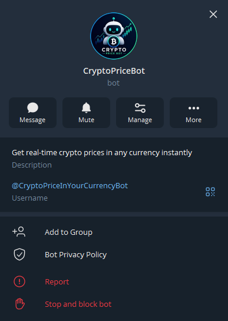
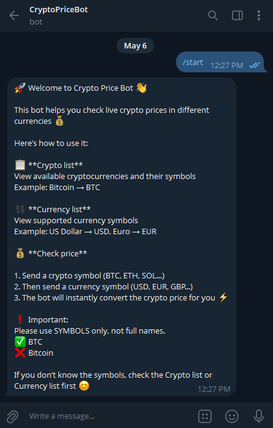
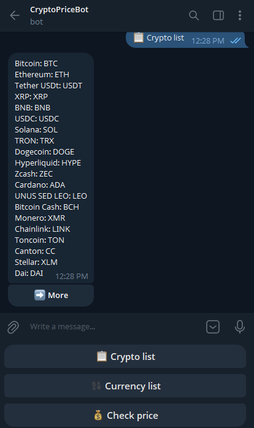
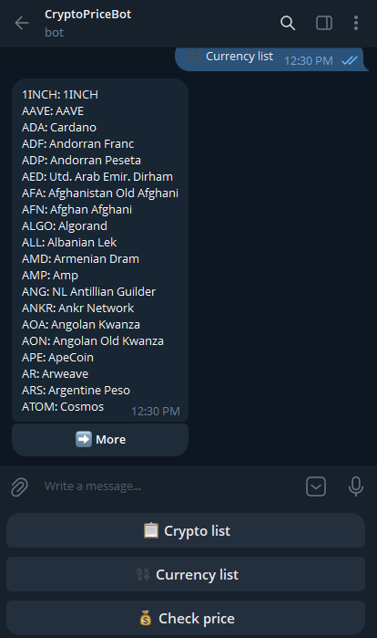
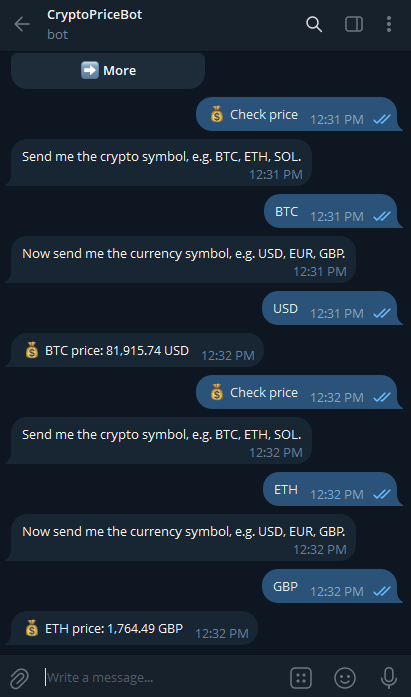

# 🤖 Crypto Price Telegram Bot

A simple and reliable Telegram bot that provides **real-time cryptocurrency prices** in any currency.

Built with Python and powered by live market data APIs.

---

## 🚀 Features

- 🔍 Get crypto prices by symbol (BTC, ETH, SOL, etc.)
- 💱 Convert prices into any currency (USD, EUR, IRR, etc.)
- ⚡ Fast and lightweight
- 🤖 Telegram bot interface
- 📡 Uses real-time API data

---

## 📸 Screenshots

  
  
  
  
  
  

---

## ⚙️ Installation

pip install -r requirements.txt